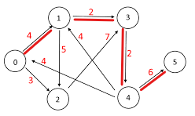

## README

## Background  

This project is divided into 2 main parts: 

<ins>First part</ins> - Implementation of a directed weighted graph with the following classes:  
NodeData - implements the node_data interface, which is the interface of nodes in an directed weighted graph.  
DiGraph - implements the GraphInterface interface, which represents the graph itself.  
GraphAlgo - implements the GraphAlgoInterface interface, which allows performing algorithmic queries on a specific graph.  
The graph was realized by using dictionary structure, and the operations were written by realizing Diexera algorithm (please see explanation in the algorithm itself).  
<ins>Second part</ins> - in this part we compared our implementation performances, to [NetworkX](https://networkx.org/) performances (*NetworkX is a python package for the creation, manipulation, and study of the structure, dynamics, and functions of complex networks).

## How to run
In order to gain more specific imformation on how to run this project please view the attached wiki pages:
- [How to run](https://github.com/Yuval-Moshe/Ex2/wiki/How-To-Run---Weighted-&-Directed-Graph)

## Definitions
 * *directed graph - a set of nodes that are connected together, where all the edges are directed from one vertex to another*
 * *weighted graph - edges of the graph are holding some sort of cost (time to cross for example)*
 
## Example:
 

 
**This graph contains 6 nodes and 9 edges.**
- connected_component() with 1 as input will return the list [0,1,2,3,4] (we can get from each node in the list to each other node from the list). 
- connected_components() function will return [[5],[0,1,2,3,4]] - no path from node 5 to any other node, and if we take any 2 nodes from [0,1,2,3,4],  
  there will be a path from first node to second node, and a path from second node to first node. 
- shortest_path() method between node 0 to node 5 will return a dict - {**14** , [0,1,3,4,5]} (14=4+2+2+6). 
Do notice that the shortest path depends on the sum of the weights of the edges between the 2 nodes
and not on the sum of the nodes between 2 nodes.

###### For more information please check the Wiki page
